# sqlalchemy-challenge
Module 10 - SQL Alchemy

## Objective
Use skills learned in module 10 to produce queries on Hawaiian weather data using SQL Alchemy in a Python environment, as well as use Flask to create an API site to display the query results.

--------------------------------------
## Precipitation Analysis
### 1. Reflect Tables into SQL Alchemy ORM
- I used the imports and dependencies included in the starter file, but I did add the inspect import on my own.
- I created an engine that connnected to the provided hawaii.sqlite file, and used automap_base() to declare a base and `Base.prepare(autoload_with=engine)`  to reflect the database schema and generate the classes within it automatically.
- To get the classes, I utilized two methods:
  - `Base.classes.keys()` which displayed each table in the database ('measurement' and 'station')
  - `inspector = inspect(engine)` followed by `inspector.get_table_names()` that verified the tables.
- Then I saved the references to each table as measurement and station.
- Next I created the session that links Python to the database with:
  - `session = Session(engine)`
  - `measurement_data = session.query(measurement).all()`
  - `station_data = session.query(station).all()`
- My final preparation before exploratory analysis was to get a sample of the measurement data as a list of tuples, to ensure that I would be able to get the information needed for my queries, see figure 1.

   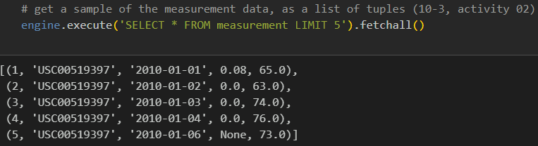

  Fig 1: sample data.

### 2. Exploratory Precipitation Analysis
* To find the most recent date in the dataset, I utililzed the `.order_by()` function with `.desc()` and `.first()`. The result was '2017-08-23'.
* To find the last 12 months of precipitation data, I used the `filter()` function on the measurement table to fetch all dates after 2016-08-23. Following this I defined a 'sel' variable that contained [measurement.date, measurement.prcp], and used that variable in the query that filtered for data on and after 2016-08-23, grouped it by date, and ordered it by date. Once this query ran, I saved the results in a dictionary named 'prcp_data' and turned it into a Pandas Dataframe, named 'prcp_df'. This dataframe was then sorted by date and saved as prcp_df_sorted.
* The next step was to plot the precipitation and dates after 2016-08-23, but I had trouble getting the plot to display properly, even with help from Xpert Learning Assistant, see figure 2.

  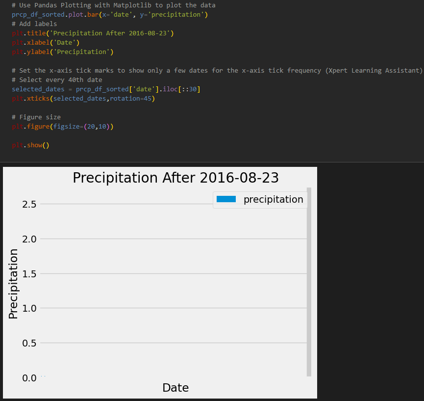

  Fig 2: failed precipitation plot.

* Finally, I used `.describe()` to generate the summary statistics for the precipitation data, see figure 3.

  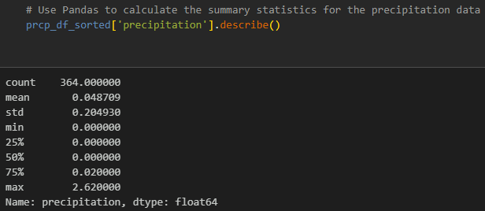

  Fig 3: precipitation summary statistics
  

------------------------------------------------------
## Station Analysis
* To find the total number of stations, I simply used the `.count()` function and found there are 9 stations.
* To find the most active stations, I designed a query that went through 'measurement.station' and used:
  * `func.count()` to count the number of rows per unique station,
  * `.group_by()` to group by unique station,
  * `.order_by().desc()` to list the most active station first,
  * `.all()` to list each one
* Following that query, I implemented a for loop to go through each station and its row count, and displaey the results, see figure 4.

  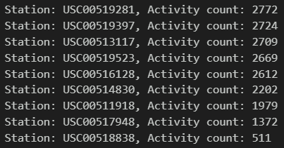

  Fig 4: most active stations.

* The next query was designed to find the minimun, maximum, and average temperature at the most active station, 'USC00519281'. I made a variable to house the min, max, and avg query functions, then fed it into a query that computed those statistics and filtered the results by station 'USC00519281'. The resulting values were (54.0, 85.0, 71.66378066378067) as (min, max, avg), respectively.
* The last step before creating a histogram was to find the temperature observation data for station 'USC00519281' from the last 12 months. I was able to accomplish this by using a simple query that filtered the measurement table by the station ID and the date range (>= 2016-08-23). I then saved this data into a dataframe called 'temp_data_df'.
* Lastly I created a histogram of the temperature data, with the temperature frequency on the y-axis and the temperature on the x-axis, see figure 5.

  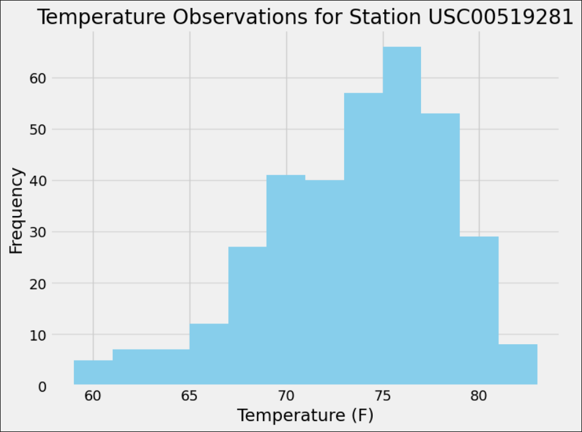

  Fig 5: temperature histogram for previous 12 months, station USC00519281
  

----------------------------------------------
## API SQLite Connection & Landing Page
* I kept the same imports on the app.py file that were already included.
* I set up the database the same way as the climate_starter.ipynb, see figure 6. I used 10-3 activity 10 as a model/reference.

  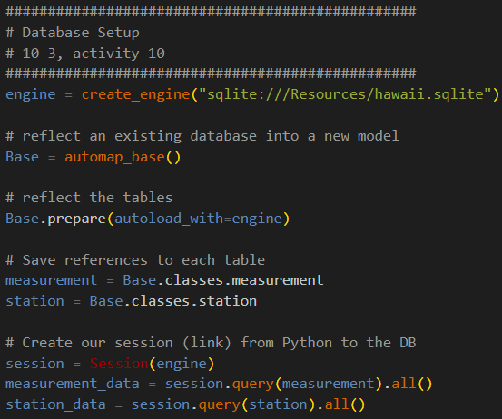

  Fig 6: database setup for Flask

### 1. API Static Routes
* I started the Flask part by first creating the app with `app = Flask(__name__)`.
* Once that condition was met, I followed a similar process to code the static routes:
  * declare a specific route with `@app.route("/[route name here]")`;
  * create a function with `def [route purpose]():`;
    * create a session within each `def ()`;
    * query the data relevant to the route;
    * close the session;
    * return the JSON-ified result with `return jsonify([query result])`
      
* Using the process outlined above, I then:
  1. Created a route to the precipitation data, with the `def ()` containing the same query as the climate_starter.ipynb for precipitation data from the last 12 months.
    * I did create a dictionary of the precipitation query results that was then fed into the jsonify function, see figure 7.
   
      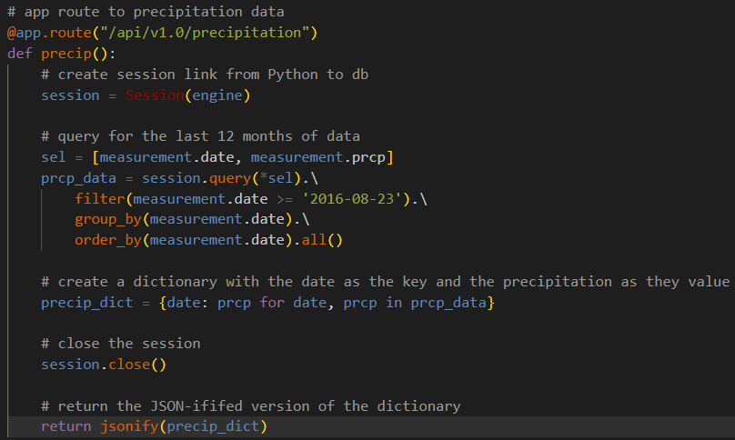

      Fig 7: code for the app route to precipitation data

  2. Created a route for a list of the stations within the database, but the `def ()` contained a simple query to get all the station IDs and put them in a list called 'station_list', which was fed into the jsonify function, see figure 8.
 
     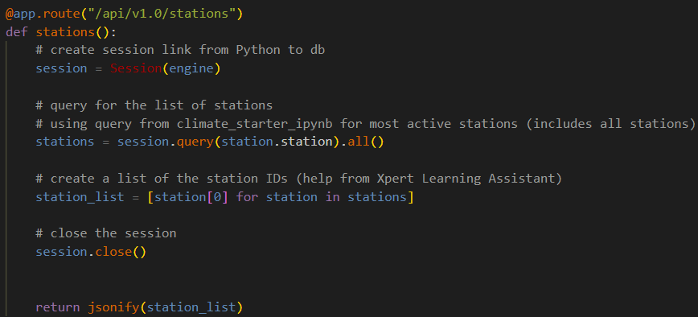

     Fig 8: code for the app route to station list

  3. Created a route to temperature data, where the `def ()` function contained a query that retrieved the temperatures for the most active station from the last 12 months, and the data was fed into the jsonify function, see figure 9.
 
     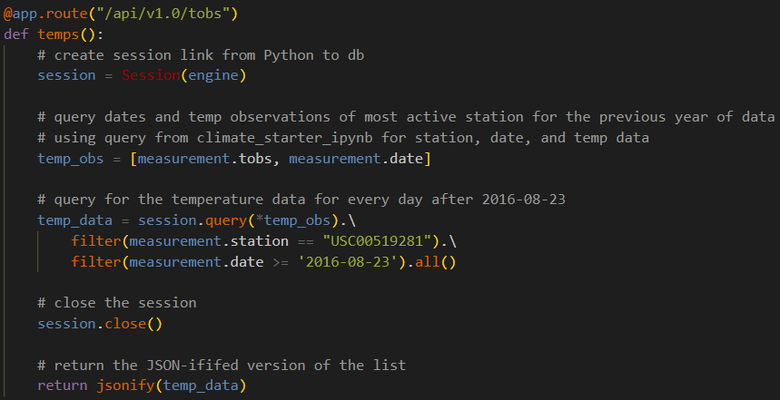

     Fig 9: code for the app route to the most active station's temperature data, from the last 12 months
     

### 2. API Dynamic Route
* The dynamic route started with defining a function to calculate the min, max, and avg temperatures for a given start/start and end date, `def temp_calc(start_date, end_date=None):`. I ended up needing to use Xpert Learning Assistant quite a bit for this code since the 10-3 activities did not have much in the way of creating dynamic routes with Flask. See figure 10 for the code for the function that will go into the actual route's function (next segment).

  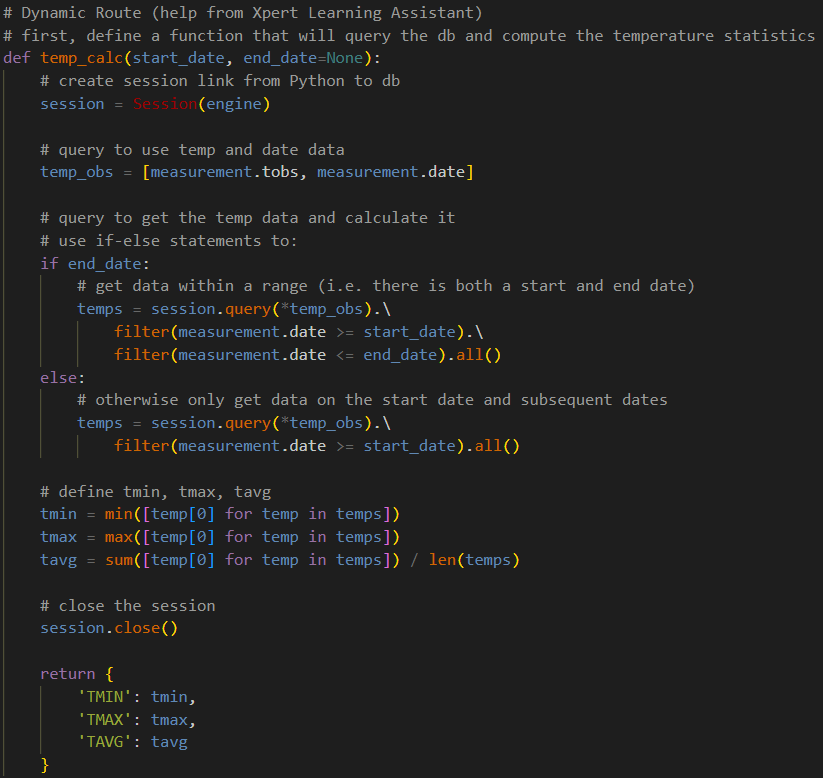

  Fig 10: first function for dynamic route, temp_calc

* After completing the temp_calc function, I defined two routes for the dynamic routes:
  * `@app.route("/api/v1.0/<start>")` where the temp_calc function was fed into `def temp_by_start_date(start):`, see figure 11.
  * `@app.route("/api/v1.0/<start>/<end>")` where the temp_calc function was fed into `def temp_by_date_range(start,end):`, see figure 11.
 
    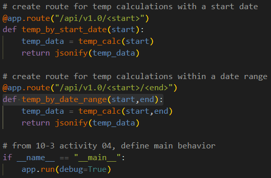

    Fig 11: dynamic routes for route with start date and route with start/end dates

* The static routes worked fine, but something is wrong with the dynamic routes and will produce an error.
----------------------------------------
## Summary
Overall the code in both climate_starter.ipynb and app.py worked as they were supposed to, with the exception of the precipitation data plot, and the dynamic routes in Flask.

----------------------------------------
## Resources
* Xpert Learning Assistant
* Module 10 Activities
